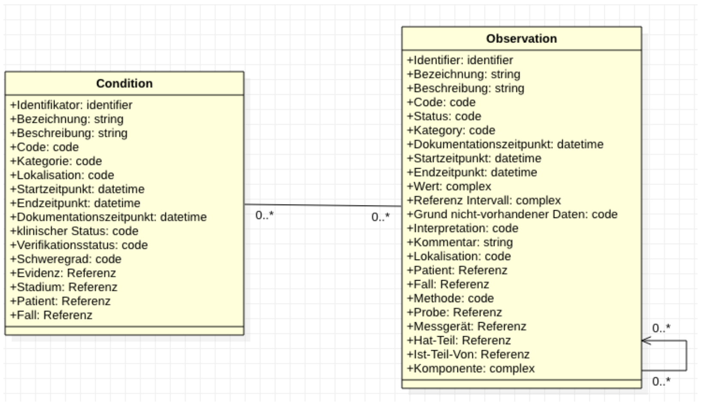

# UML Diagrams - MII IG Symptom v2027.0.0-ballot.rc1

* [**Table of Contents**](toc.md)
* [**Guidance**](guidance.md)
* **UML Diagrams**

## UML Diagrams

 This page includes translations from the original source language in which the guide was authored. Information on these translations and instructions on how to provide feedback on the translations can be found [here](translationinfo.html). 

### UML

As a more abstract version of an information model and to better illustrate the relationships of the subject-matter concepts to one another, a UML class diagram was created based on the specifications in ART-DECOR. Concepts represented as groups in ART-DECOR are modeled as separate classes that have association relationships to one another here. This logical model serves only to represent the data elements and their descriptions. The data types and cardinalities used are not to be regarded as binding. This is finally determined by the FHIR profiles. The assignment of the FHIR elements to the ART-DECOR specification is described in the comment field in ART-DECOR.

